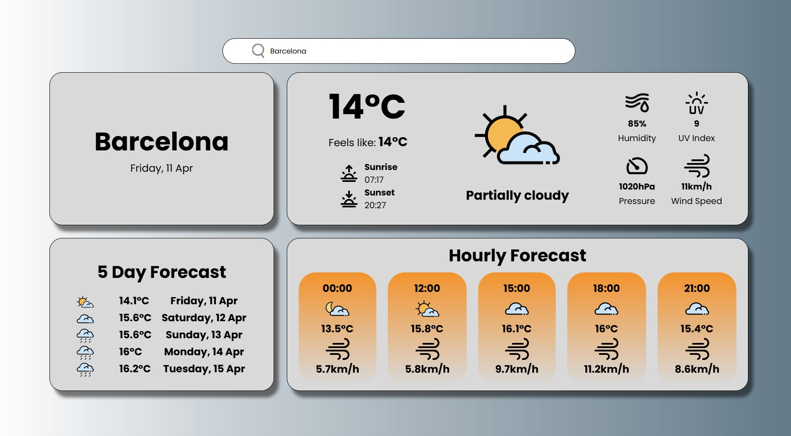

# Weather App 🌤️

[](https://555viktor.github.io/weather-app/)

## Live Preview  
Check out the deployed project here: [https://555viktor.github.io/weather-app/https://555viktor.github.io/weather-app/] or click the image.

## Project Overview  
This is a web-based **Weather App** built using **HTML**, **CSS**, **JavaScript**, and **Webpack**. The app provides users with real-time weather data including today's forecast, hourly forecast, 5-day forecast, wind speed, pressure, UV light levels, and humidity. This project was developed as part of **The Odin Project's** curriculum.

## Features  
This weather app includes the following features:
- **Search by City:** Enter any city name to retrieve weather data.
- **Today's Forecast:** Displays the current weather conditions, temperature, and more.
- **Hourly Forecast:** Shows hourly weather predictions for the upcoming hours.
- **5-Day Forecast:** Displays weather predictions for the next 5 days.
- **Wind Speed & Pressure:** View the current wind speed and atmospheric pressure.
- **UV Light & Humidity:** Get real-time data on UV light levels and humidity.

## Technologies Used  
- **HTML** – For the structure and layout of the app.
- **CSS** – For styling the app.
- **JavaScript** – To fetch and display real-time weather data using a weather API.
- **Webpack** – For bundling and optimizing JavaScript, CSS, and other assets, ensuring better performance.
- **VirtualCrossing API** – To retrieve live weather data based on user input.
- **API Handling** – Uses JavaScript to interact with the weather API and display data dynamically.

## Installation  
To get started with this project locally:

1. Clone the repository to your machine:
   ```bash
   git clone https://github.com/555Viktor/weather-app.git
   ```

2. Navigate into the project folder:
   ```bash
   cd weather-app
   ```

3. Install the required dependencies:
   ```bash
   npm install
   ```

4. Run the Webpack development server to start the app locally:
   ```bash
   npm run start
   ```

5. Open `localhost:8080` in your preferred browser to start using the weather app!

## Usage  

1. **View Weather Data:**  
   - Enter a city name in the search bar to see the weather data for that location.  
   - View the current temperature, hourly forecast, 5-day forecast, wind speed, pressure, UV light levels, and humidity.

2. **Real-Time Updates:**  
   - The app fetches live weather data from an API, so the weather information is always up-to-date.

## Acknowledgements  
This project was developed as part of **The Odin Project's** curriculum to help improve my skills in front-end development, API handling, and using build tools like **Webpack**. A special thanks to **VirtualCrossing** for providing the weather data API.
